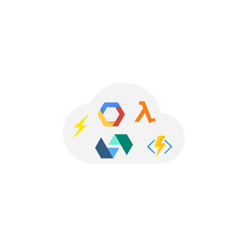
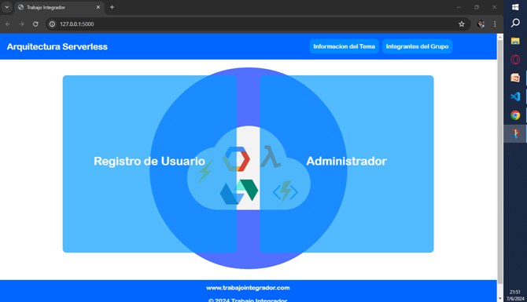
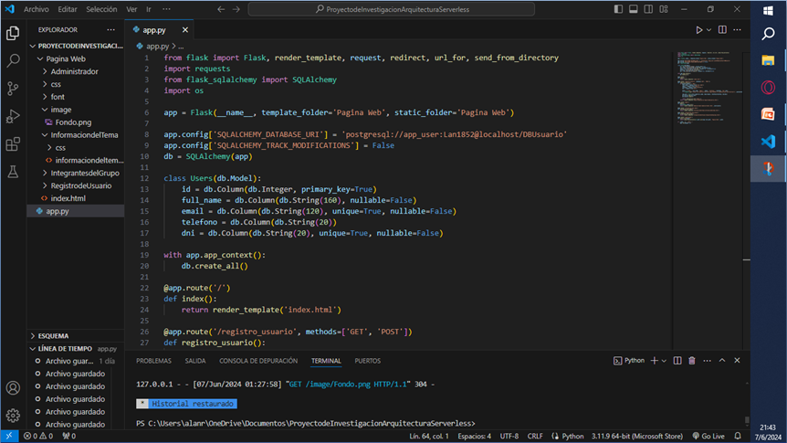
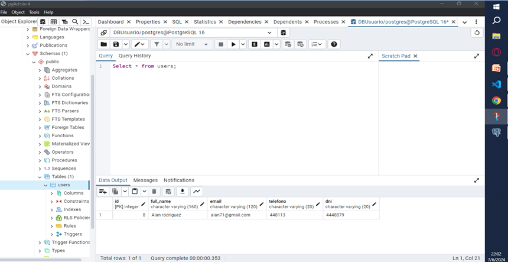
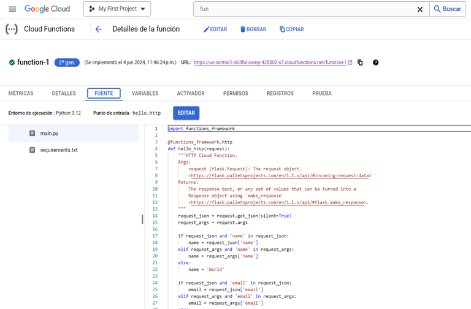

# Arquitectura Serverless

  

## Introducción
En este espacio les contaré qué es la Arquitectura Serverless, sus características principales y cómo se aplicó en nuestro trabajo de investigación. Exploraremos sus ventajas, casos de uso y las conclusiones obtenidas a partir de nuestra experiencia.

## Índice de contenidos
En este apartado, se visualizará la estructura del tema a abordar. Este índice servirá como guía para navegar por los distintos apartados de la explicación.

1. [¿Qué es la Arquitectura Serverless?](#Qué-es-la-Arquitectura-Serverless)
2. [Características principales](#Características-principales) 
3. [Ventajas y Desventajas](#Ventajas-y-Desventajas) 
4. [¿Qué son las FaaS y BaaS dentro de la Arquitectura Serverless?](#Qué-son-las-FaaS-y-BaaS-dentro-de-la-Arquitectura-Serverless)
5. [Usos más comunes](#Usos-mas-comunes)
6. [Proveedores de Arquitectura Serverless](#Proveedores-de-Arquitectura-Serverless)
7. [Aplicación en el proyecto de investigacion](#Aplicación-en-el-proyecto-de-investigacion)
8. [Glosario](#Glosario)

## ¿Qué es la Arquitectura Serverless?
La Arquitectura Serverless es una computación sin servidores (Serverless), un modelo de ejecución en el que el proveedor en la nube es el responsable de ejecutar un fragmento de código. El código se ejecuta dentro de contenedores sin estado y puede ser activado por una variedad de eventos que incluyen [solicitudes HTTP](#Glosario), bases de datos, servicios de colas, alertas de monitoreo, carga de archivos y eventos programados. El código que se envía al proveedor en la nube para la ejecución es generalmente en forma de función.

## Características principales
Las características principales de la Arquitectura Serverless son las siguientes:

* Sin gestión de servidores: No se necesita por parte del desarrollador configurar ni administrar el servidor. Es manejada automáticamente por el proveedor en la nube.
* Ejecución basada en evento: Las funciones son eventos que toman la forma de peticiones HTTP, cambios en bases de datos, carga de archivos en la nube o eventos de mensajería.
* Pago por uso (modelo FaaS - Functions as a Service): Solo se cobra por el tiempo de ejecución y la cantidad de invocaciones, lo que reduce costos en comparación con los servidores 
  tradicionales.
* Compatibilidad con multiples lenguajes: Los principales proveedores ofrecen soporte para diversos lenguajes, como Python, JavaScript (Node.js), Java, Go y más.
* Menos consumos de recursos: Al no necesitar servidores en ejecución constante, Serverless reduce el consumo de recursos cuando no hay actividad. 

## Ventajas y Desventajas

Ventajas: 
* No hay necesidad de administrar infraestructura: Esto quiere decir que no hay necesidad de administrar servidores, mantener los sistemas operativos o instalar y actualizar software, 
  ya que todo es responsabilidad del proveedor de la nube.
* Escalabilidad: Se escala de forma automática y mantiene un equilibrio en cuanto a recursos, esto indica que se adapta a las necesidades del cliente.
* Ahorro de costos: Solo se paga lo que se usa, en este caso se paga por el tiempo que dura la ejecución, en lugar de pagar por una instancia.
* Alta disponibilidad y tolerancia a fallas: Sin necesidad de hacer algún proceso para replicar datos en diferentes zonas disponibles, ofrece una alta disponibilidad y tolerancia a 
  fallas de forma predeterminada.

Desventajas:
* Dependencia de proveedores: Puede implicar riesgo asociado con confiar en un único proveedor, ya que puede haber cambios en servicios, precios o fallas del proveedor que pueden 
  impactar negativamente en la operación.
* Menos control sobre la infraestructura: Los desarrolladores tienen limitado control sobre los servidores. Esto puede restringir la personalización y optimización de configuraciones 
  específicas.
* Preocupaciones de seguridad: Preocupación por la privacidad de los datos que se alojan en la nube de terceros. Esto aumenta el riesgo de seguridad cibernética.
 
## ¿Qué son las FaaS y BaaS dentro de la Arquitectura Serverless?
Son dos tipos de servicios que utilizan la computación sin servidor:

* FaaS (Functions as a Service - Función como Servicio): El modelo se basa en las tecnologías y arquitecturas informáticas sin servidores que permiten a los desarrolladores de software 
  implementar fácilmente aplicaciones en la nube sin tener que administrar servidores.

* BaaS (Backend as a Service - Backend como Servicio): Es un modelo de servicio en la nube en el que los desarrolladores subcontratan todos los aspectos detrás de escena de una 
  aplicación web o móvil para que solo tengan que escribir y mantener la interfaz. Los proveedores de BaaS proporcionan software prescrito para actividades como: Autenticación de 
  usuario, Administración de base de datos, Actualización remota y Notificaciones push, Almacenamiento y Alojamiento en la nube.

   
## Usos más comunes
La tecnología serverless es ideal para microservicios, backend móviles, procesamiento de eventos y flujo de datos. Su uso más comunes es:

1. Aplicaciones web o API backends: Está orientado a la ejecución de eventos, como por ejemplo en una aplicación de tareas donde los usuarios pueden crear, actualizar, ver y eliminar 
   elementos, por medio de funciones que pueden convertirse en un [endpoint HTTP](#Glosario).

2. Procesamiento de datos: Para trabajar con datos estructurados de texto, audio, imagen y video.

## Proveedores de Arquitectura Serverless

Los siguientes proveedores que utilizan Arquitectura Serverless son: 

* AWS Lambda: Permite ejecutar código automáticamente en respuesta a eventos generados por otros servicios de AWS (como [S3](#Glosario), [DynamoDB](#Glosario) o [API Gateway](#Glosario)) o eventos personalizados, se cobra 
  únicamente por el tiempo de ejecución y la cantidad de invocaciones, eliminando costos fijos asociados a servidores tradicionales, admite varios lenguajes de programación, como
  Python, Node.js, Java, Go y Ruby, entre otros, funciona de manera eficiente con servicios como S3, DynamoDB, [API Gateway](#Glosario), [SNS](#Glosario) y [Kinesis](#Glosario), 
  permitiendo construir arquitecturas altamente distribuidas y escalables.
  
* Google Cloud: Permite respuesta a eventos de Google Cloud (como cambios en [Cloud Storage](#Glosario), mensajes en [Pub/Sub](#Glosario) o [solicitudes HTTP](#Glosario)) o eventos 
  personalizados, ejecucion basada en 
  eventos, admite JavaScript (Node.js), Python, Go, Java, .NET y Ruby, funciona con Firebase, BigQuery, Cloud Storage, Firestore y Pub/Sub, entre otros, 
  facilitando arquitecturas distribuidas.
     
* Azure Functions: Proporcionado por Microsoft Azure. Permite ejecutar código en respuesta a eventos sin necesidad de administrar servidores, facilitando la creación de aplicaciones 
  escalables y optimizadas en costos, se activa en respuesta a eventos generados por otros servicios de Azure (como [Blob Storage](#Glosario), [Event Grid](#Glosario), [Cosmos DB](#Glosario)) o mediante solicitudes HTTP, 
  soporta varios lenguajes de programación, incluyendo C#, JavaScript, Python, Java, TypeScript y PowerShell, funciona de manera nativa con otros servicios como Azure Storage, Service 
  Bus, Event Hubs y Logic Apps, facilitando arquitecturas serverless completas y permite desarrollar y probar funciones en entornos locales antes de desplegarlas en la nube.

* IBM Openwhisk: Código abierto desarrollada por IBM. [OpenWhisk](#Glosario) se basa en Apache OpenWhisk y está diseñado para integrarse con múltiples servicios en la nube, facilitando 
  el 
  desarrollo de aplicaciones escalables y [event-driven](#Glosario), tambien permite desencadenar la ejecución de funciones en respuesta a eventos provenientes de diversas fuentes, 
  como bases de 
  datos, colas de mensajes o peticiones HTTP, al estar basado en Apache OpenWhisk, los desarrolladores pueden personalizar y extender sus funcionalidades según sus necesidades. 
  Soporta lenguajes como JavaScript (Node.js), Python, Swift, PHP, Ruby y Java, brindando flexibilidad a los desarrolladores y se conecta con servicios como [IBM Cloud](#Glosario) 
  [Functions](#Glosario), [IBM Watson](#Glosario), [IBM Cloudant](#Glosario) y otras soluciones en la nube.  

## Aplicación en el proyecto de investigacion
Este proyecto de investigación fue hecho en la Universidad Nacional del Oeste, junto con mis compañeros Leones Nicolás, Cruz Brian, Juárez Alex Contreras, en la carrera Licenciatura en Informática, materia Interfaz de Usuario y Tecnología Web. El proveedor para realizar este proyecto de investigación es Google Cloud, ya que una de las funciones que nos daba fácilmente es poder trabajar en grupo de forma eficiente.

Para la creación de la aplicación web usamos las siguientes tecnologías:

1. Creación de la interfaz gráfica: Usamos HTML para estructurar cada sector de la página, definiendo los elementos básicos y su disposición. Para la parte de estilo, a cada parte de la página usamos CSS para definir los colores, tipografía, márgenes y la disposición visual de los elementos.

 

  

2. Desarrollo de funciones: Para desarrollar las funciones se utilizó el lenguaje Python y dentro de la misma las siguientes bibliotecas:
   - Flask: Para renderizar cada plantilla (acceso a cada parte de la página web) y manejo de rutas.
   - Requests: Para hacer llamadas (solicitudes) HTTP a servidores externos, en este caso a Google Cloud.
   - os: Para construir la ruta completa de los archivos estáticos, para que se pueda visualizar la interfaz hecha en CSS.
   - SQLAlchemy: Para gestionar la interacción con la base de datos, creada localmente con PgAdmin.

  

  
  

3. Uso de la Arquitectura Serverless (Google Cloud): Utilizamos de Google Cloud específicamente [Cloud Functions](#Glosario), para actuar como intermediario en la visualización de acceso (registros en la página web) y en la supervisión de los datos que se almacenan en la base de datos. Para cumplir con esta función, Cloud Functions proporciona un URL que se integra en el código Python. Durante la ejecución, cuando se realiza una acción de registro, se envía un mensaje HTTP a Cloud Functions, respondiendo a este evento y registrándolo para poder visualizar qué evento se realizó. 

  

  

Conclusion grupal y posibles mejoras:
 * El acercamiento a las tecnologías cloud fue más duro de lo que pensábamos, nos queda la experiencia de tener un primer acercamiento, por lo que si en el futuro tenemos que utilizar 
   nuevamente estas tecnologías (y de seguro sucederá), ya contamos con un camino recorrido, el cual nos dio una pequeña pero valiosa experiencia en el mundo cloud.
   
 * Las posibles mejoras que podríamos implementar a futuro son:
    - Mejorar el estilo de la página, ya que preferimos enfocarnos en la funcionalidad y no tanto en el diseño.
    - Configurar un ABM de usuarios, ya que actualmente solamente se puede realizar la acción de dar de alta un usuario.
    - Poder guardar los datos en una BBDD en la nube.
    - Poder realizar las acciones de ABM de usuarios utilizando Cloud Functions y que se guarden los datos en la BBDD en la nube.

Links Importantes:

 - 🎥 [Video de demostración del proyecto](https://youtu.be/_6IrMyfibI0)

 - 📄 [Carpeta de desalojo del código](https://github.com/alanro21/Arquitectura-Serverless/tree/main/ProyectodeInvestigacionArquitecturaServerless)

## Glosario

* Solicitudes HTTP: Las solicitudes HTTP son mensajes enviados por un cliente (como un navegador) a un servidor para obtener información o realizar acciones. Se utilizan los siguientes 
  métodos comunes:
  - GET: Solicita datos del servidor.
  - POST: Envía datos al servidor.
  - PUT: Actualiza un recurso existente.
  - DELETE: Elimina un recurso.
  - PATCH: Modifica parcialmente un recurso.

* Endpoint HTTP: Es una URL específica que un cliente utiliza para interactuar con un servidor o API. Representa un punto de acceso para realizar operaciones como obtener, enviar, 
  actualizar o eliminar datos. Los endpoints están asociados a métodos HTTP (GET, POST, PUT, DELETE) y permiten que los clientes y servidores se comuniquen de manera eficiente.

* S3: Es un servicio de almacenamiento en la nube proporcionado por Amazon Web Services (AWS). Permite almacenar y recuperar cualquier cantidad de datos en cualquier momento y desde 
  cualquier lugar. S3 es ampliamente utilizado para guardar archivos, copias de seguridad, datos estáticos (como imágenes y videos) y para aplicaciones que necesitan almacenamiento 
  escalable y duradero.

* DynamoDB: Es un servicio de base de datos NoSQL completamente administrado por Amazon Web Services (AWS). Está diseñado para ofrecer alta disponibilidad, escalabilidad y rendimiento 
  rápido en aplicaciones que necesitan manejar grandes volúmenes de datos con bajas latencias.

* API Gateway: Es un servicio gestionado que facilita la creación, implementación y gestión de APIs (Interfaces de Programación de Aplicaciones) a gran escala. Es proporcionado por 
  varios proveedores en la nube, como Amazon API Gateway, y permite que las aplicaciones se comuniquen entre sí de forma segura y eficiente.
  
* SNS: Es un servicio de mensajería en la nube de Amazon Web Services (AWS) que facilita el envío de mensajes a una amplia gama de destinatarios, como aplicaciones, sistemas o 
  usuarios. SNS permite enviar notificaciones de manera escalable y flexible.
  
* Kinesis: Es un servicio de AWS diseñado para la recopilación, procesamiento y análisis de grandes volúmenes de datos en tiempo real. Es utilizado para manejar flujos de datos 
  generados por aplicaciones, dispositivos IoT, redes sociales y otros sistemas que generan grandes cantidades de información rápidamente.
  
* Firebase: Es una plataforma de desarrollo de aplicaciones móviles y web proporcionada por Google Cloud. Ofrece una serie de herramientas y servicios que permiten crear, gestionar y 
  escalar aplicaciones de manera eficiente, enfocándose en la simplicidad y la integración con otros servicios de Google Cloud.
  
* BigQuery: Es un servicio de análisis de datos en la nube proporcionado por Google Cloud. Está diseñado para manejar grandes volúmenes de datos, ofreciendo consultas rápidas y 
  escalabilidad automática sin necesidad de gestionar la infraestructura subyacente.
   
* Cloud Storage: Es un servicio de almacenamiento de archivos en la nube que permite guardar y acceder a datos desde cualquier lugar a través de Internet. Proporcionado por diversos 
  proveedores como Google Cloud Storage o Amazon S3, está diseñado para ser escalable, seguro y de alto rendimiento.
   
* Firestore: Es una base de datos en tiempo real y escalable proporcionada por Firebase de Google Cloud. Está diseñada para aplicaciones móviles y web, permitiendo almacenar, 
  sincronizar y consultar datos de manera eficiente con un alto rendimiento.
  
* Pub/Sub: Es un servicio de mensajería en tiempo real proporcionado por Google Cloud. Permite a las aplicaciones enviar y recibir mensajes de manera eficiente a través de un modelo de 
  publicación y suscripción, ideal para arquitecturas distribuidas y sistemas desacoplados.

* Cloud Functions: Es un servicio de computación sin servidor (serverless) proporcionado por Google Cloud que permite ejecutar funciones de código en respuesta a eventos, como cambios 
  en bases de datos, solicitudes HTTP, o mensajes en una cola de Pub/Sub, sin necesidad de administrar servidores.

* Blob Storage: Es un servicio de almacenamiento de objetos en la nube de Microsoft Azure. Está diseñado para almacenar grandes cantidades de datos no estructurados, como imágenes, 
  videos, audios y otros archivos.
  
* Event Grid: Es un servicio de gestión de eventos que permite la creación de aplicaciones basadas en eventos mediante la integración con otros servicios de Azure.
  
* Cosmos DB: Es una base de datos NoSQL distribuida globalmente de Microsoft Azure. Ofrece baja latencia, escalabilidad horizontal, y alta disponibilidad, diseñada para aplicaciones 
  que requieren rendimiento en tiempo real y gran volumen de datos.
  
* Azure Storage: Es un conjunto de servicios de almacenamiento en la nube de Microsoft Azure. Ofrece almacenamiento de blobs, archivos, colas y discos, adecuados para una variedad de 
  aplicaciones.
  
* Service Bus: Es un servicio de mensajería en la nube que facilita la comunicación entre aplicaciones y servicios distribuidos.
  
* Event Hubs: Es una plataforma de ingesta de eventos de alta capacidad que permite recibir y procesar millones de eventos por segundo.
 
* Logic Apps: Es un servicio de automatización de flujos de trabajo en la nube que permite a los desarrolladores integrar aplicaciones y servicios de manera visual.
    
* OpenWhisk: Es una plataforma de computación sin servidor (serverless) de código abierto que permite ejecutar funciones en la nube de manera automática en respuesta a eventos. Fue 
  desarrollada inicialmente por IBM, pero ahora está disponible como un proyecto de código abierto, lo que permite que cualquier persona lo use y lo personalice.
  
* Event-driven: Es un enfoque de programación donde las acciones o eventos (como clics, cambios de estado o mensajes) provocan la ejecución de ciertas funciones o procesos dentro de un 
  sistema. Este enfoque es fundamental en la arquitectura de microservicios y sistemas distribuidos, permitiendo que las aplicaciones respondan a eventos de manera dinámica.
   
* IBM Cloud Functions: Es un servicio de cómputo basado en la arquitectura serverless proporcionado por IBM. Permite ejecutar funciones en la nube sin la necesidad de gestionar 
  servidores, permitiendo a los desarrolladores enfocarse en el código mientras la infraestructura se maneja automáticamente.
  
* IBM Watson: Es una plataforma de inteligencia artificial (IA) y aprendizaje automático proporcionada por IBM. Watson está diseñada para ayudar a las empresas a tomar decisiones 
  informadas, mejorar la experiencia del cliente y automatizar procesos mediante el uso de análisis avanzados y procesamiento de lenguaje natural.
  
* IBM Cloudant: Es un servicio de base de datos NoSQL basado en la tecnología de CouchDB, proporcionado por IBM. Está diseñado para manejar grandes volúmenes de datos con baja latencia 
  y alta disponibilidad, especialmente en aplicaciones distribuidas y móviles.

